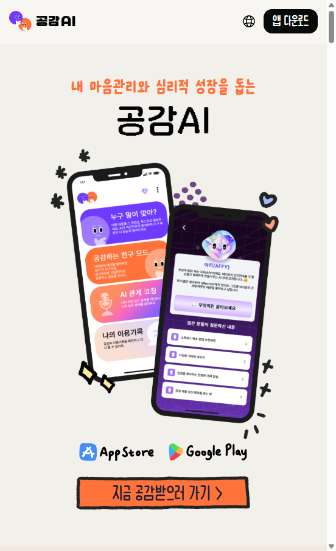
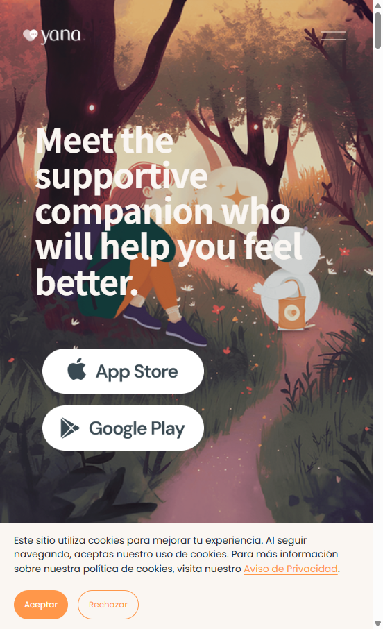
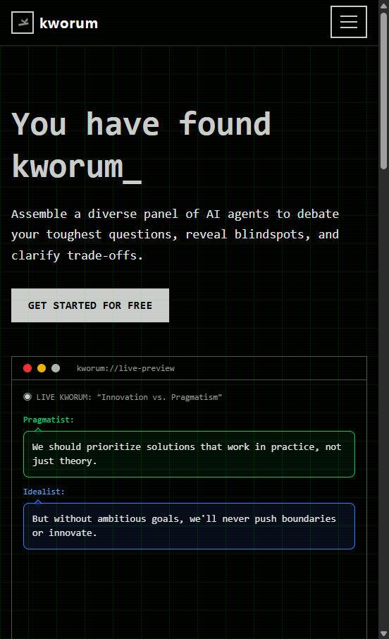

# 경쟁 서비스 리서치 — 공감 톡톡 (Gonggam Toktok)

**리서치 일자:** 2026-04-26  
**비교 기준:** [week_6/MISSION.md](../MISSION.md) — AI 기반 정서·커뮤니케이션 지원, 멀티 에이전트 토론, 클라이언트 맞춤 전략, (로드맵) 음성.

**탐색 도구:** Cursor `cursor-ide-browser` MCP(CLAUDE 토큰부족으로 커서사용) — 랜딩 URL 방문 후 뷰포트 스크린샷 자동 저장.

---

## 1. 선정한 경쟁·인접 서비스 3곳 (국내 1 + 해외 1 + 인접 1)

| 구분 | 서비스 | 선정 이유 (한 줄) |
|------|--------|-------------------|
| 국내 | **공감 AI (톡티, Tokti)** | 한국어·갈등/대화 분석·정서 지지·챗봇(아피)로 **공감 톡톡의 정서·소통** 축과 직접 겹침. |
| 해외 | **Yana** | 글로벌 **감정 동반·24h 안전한 공간**·무료+프리미엄; 다국어 시장·앱스토어 리뷰 풀 부담. |
| 인접 | **Kworum** | **멀티 에이전트 토론**·맞춤 에이전트·멀티 LLM; 정서가 아닌 **의사결정·관점 대립** 쪽으로 포지셔닝. |

---

## 2. 서비스별 요약 (랜딩·공개 FAQ 기준)

### 2.0 AI·서비스 비교 분석표 (통합)

아래는 **AI가 하는 일의 성격**, **누구를 위한 제품인지**, **공감 톡톡 MISSION**과의 거리감을 한눈에 본다. (자료: 공식 랜딩·FAQ, 2026-04-26 캡처 기준)

| 비교 항목 | 공감 AI (톡티, Tokti) | Yana | Kworum |
|-----------|------------------------|------|--------|
| **서비스 성격** | 감정·관계·갈등 **1:1 테라피/코칭** 앱(웹 랜딩 + 앱스토어) | **감정 동반(Emotional companion)** — 글로벌 모바일 앱 중심 | **멀티 에이전트 토론/의사결정** 도구 — 지적·전략 질문에 가깝 |
| **핵심 AI 역할** | 대화·갈등 **분석/중재**, 정서 **위로** (챗봇 아피 등) | **경청·지지·훈련**(어려운 대화 연습, 기분·습관) | **서로 다른 관점의 AI**가 **토론**해 블라인드스팟·트레이드오프 정리 |
| **멀티 에이전트** | **아님** (단일/제품 내 페르소나는 있으나 “토론 구조”는 Kworum 수준 아님) | **아님** (1:1 동반) | **핵심** — Multi-Agent Debates, Custom agents, Multi-LLM |
| **정서·공감 축** | **강** — “공감”, 갈등 객관화, 정서적 지지 문구 | **강** — “judgment-free”, 안전한 공간, 24h | **약** — 감정 케어보다 **논증·관점** |
| **비즈·협상·클라이언트 전략** | 간접(대화/관계) — **B2B 컨설 포지션**은 랜딩상 미강조 | “시나리오 연습” 등 **일반** 난제에는 활용(직장·협상 **전문 툴**은 아님) | **의사결정·전략** 질문에 유리, **감정선+한국 협상**은 제품 본질과 거리 |
| **음성 (STT/TTS)** | 랜딩·스토어 기준 **앱·대화** 중심(세부는 앱 내) | 음성·텍스트 병행 강조(제품 evol.) | 랜딩 기준 **채팅형 토론** 강조, “보이스”는 부차 |
| **사례·RAG(외부지식)** | “수십만 건” 학습·분쟁 데이터 등 **내부/학습** 어필(공개 RAG 스펙은 제한) | 콘텐츠·가이드·앱 내 리소스 (사용자 **개인** 스토리 중심) | 질문·에이전트에 따라 **LLM+웹** 가정 (제품은 토론 오케스트레이션) |
| **가격 인상** | **무료 이용 가능** 문구(상세 티어는 앱) | **부분 무료 + 프리미엄** (FAQ 명시) | **Free to try** (CTA) — B2B/Pro 가능성, 랜딩에 상세 $ 미표기 |
| **UX·톤** | 컬러풀·친밀·**모바일** UI 스크린 강조 | **일러스트**·따뜻한 “동반” 톤 | **다크**·**데모 UI**·토론 데스크/파워유저 |
| **강점(한 줄)** | **한국어** 갈등·OCR 맥락 분석·정서+이성 **혼합** | 규모·완성도·**“치료 대체 아님”** 등 FAQ 노출 | **다자 토론**·**맞춤 에이전트**·멀티 LLM |
| **한계·리스크(한 줄)** | 톡티랩 **다른 앱**으로 이탈·브랜드 산만 가능 | **로컬라이징/과금** 민감, **일반 감정**에 포지셔닝 | **감정·한국 직장문화**와 거리, **B2B 안건 문서**와 직접 연결 약 |
| **공감 톡톡과의 관계** | **직접 경쟁(정서·대화)**, 토론·실행안·B2B는 **우리가 확장**할 지점 | **감정 인접** — “협상/컨설”까지는 **다른 각도**로 차별 | **기술 인접(멀티에이전트)** — 정서·스크립트·한국은 **우리가 결합**할 지점 |

**요약:** 톡티·Yana는 **1:1 정서/관계** 축, Kworum은 **N:N AI 토론** 축. 공감 톡톡 MISSION(멀티 에이전트 **+** 정서·클라이언트 **전략**)은 **두 축의 중간~융합**에 해당한다.

### 2.1 핵심 가치 제안 (Value Proposition)

| | 공감 AI (톡티) | Yana | Kworum |
|---|----------------|--------|--------|
| **한 줄** | 수십만 건 발화·심리 분석을 학습한 **채팅 테라피**·갈등 **제3자 시각**·챗봇 아피 | **감정 동반자**; 판단 없이 듣고 지지, 24h 안전한 공간 | **AI 패널 토론**으로 난제·블라인드스팟·트레이드오프 명확화 |

### 2.2 주요 기능 3가지 (각 서비스)

| | 공감 AI (톡티) | Yana | Kworum |
|---|----------------|--------|--------|
| 1 | 대화 스크린샷 **OCR**로 맥락·감정 분석 | 털어놓기, **어려운 대화 연습**, 조언 요청 | **Multi-Agent Debates** (복수 AI 동시 토론) |
| 2 | **이성적 판단 모드** (갈등 객관화·대처 제안) | 기분·목표 기반 활동, **내면의 대화** 긍정 확언 | **Custom AI Agents** (관점·목표·토론 스타일) |
| 3 | **아피** 챗봇(정서·마음챙김) | 감정 패턴 추적, 앱 내 추가 콘텐츠 | **Interactive Moderation**·**Multi-LLM** |

### 2.3 가격·과금 (공개 페이지 기준)

| | 공감 AI (톡티) | Yana | Kworum |
|---|----------------|--------|--------|
| | 랜딩에 **「무료 이용 가능」** 문구·스토어 유도; 세부 티어는 앱 내 | FAQ: **부분 무료** + **프리미엄** 구독(고급 기능·콘텐츠) | **「Free to try」** (랜딩 CTA) — 세부 $ 표는 랜딩 상단에 명시되지 않음 |

### 2.4 UX 특징

| | 공감 AI (톡티) | Yana | Kworum |
|---|----------------|--------|--------|
| | 모바일 퍼스트·앱스토어 CTA; 톡티랩 **다앱/랜딩 푸터**로 이탈 가능 | **일러스트+앱다운로드** 중심, 친밀·비판단 톤 | **다크·터미널틱**·토론 프리뷰 — 개발자·지적 의사결정 톤 |

### 2.5 (참고) 공개된 불만·리스크 단서

- **Yana (FAQ):** “치료 **대체 불가**”, 13세 이상, 일부 **유료** — 규제·기대치 관리 문구가 명확함.  
- **멘탈/감정 앱 일반 (앱스토어·Reddit 등에서 자주 언급되는 유형):** “일반 챗봇과 **차별 없음**”, “**구독 비용**”, “**위기 대응**은 부족” — 공감 톡톡은 B2B·협상·멀티 관점에 초점을 두면 차별 여지.  
- 예시 링크(재확인용): [Yana — App Store 검색](https://apps.apple.com/) · [Yana — 공식 FAQ](https://www.yana.ai/) (이용료 FAQ 섹션).

---

## 3. 스크린샷 (MCP 캡처, 2026-04-26)

랜딩(뷰포트) 기준. 파일 경로: `week_6/Research/screenshots/`

---

## 4. 공감 톡톡의 차별화 포인트 (3가지)

1. **멀티 에이전트 + 정서·비즈 맥락의 결합**  
   Kworum류는 “토론·트레이드오프”에 가깝고, 공감 AI·Yana는 **1:1 감정 지지**에 가깝다. 공감 톡톡은 **분석가·전략가·감성 케어** 등 **페르소나 토론** 후 **실행안(Action Plan)**·**클라이언트 대응 스크립트**까지 한 흐름으로 묶는 **하이브리드**를 노릴 수 있음.

2. **한국어·한국 조직/협상 문화**  
   톡티는 갈등·친밀 맥락에 강하고, Yana는 글로벌 **일반 감정**에 강하다. **컨설턴트·협상가**의 “안건 단위” 브리핑, **RAG 성공 사례**(국내 톤)는 아직 **세분 카테고리**로 남을 여지.

3. **(로드맵) 페르소나 음성**  
   STT/TTS·**따뜻함/전문성** 보이스 선택은 감정 앱·세일즈 코칭앱이 각각 일부 갖고 있으나, **“토론 요약 + 선택 음성으로 재브리핑”**은 조합이 적어 포지셔닝 여지.

---

## 5. 제출·GitHub

- **원본 파일 경로(로컬 워크트리):** `afm-2th-weekday/week_6/Research/research.md`  
- **원격 푸시 후** GitHub에서 `blob` 또는 `raw` URL을 과제에 제출하면 됨.

**과제 보너스:** “AI와의 리서치 대화” 스크린샷 1장은 **본 Cursor 채팅**을 캡처해 제출 (코드로 생성 불가).

---

## 6. 메타: 리서치 한계

- 가격·기능의 **최신 수치**는 앱·로그인 후 화면만 정확; 본 문서는 **공개 랜딩·FAQ** 위주.  
- 의료·심리 **표현 규제**는 출시 전 법률 검토 필요.
