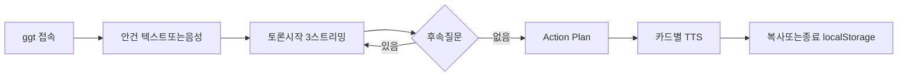

# 공감 톡톡 — 제품 기획서 (AFM 8주차)

> **과제/동기화용** `week_6` 사본. **제품·코드 정본**은 [daonms/DAONAI `PROJECT/GonggamToktok/`](https://github.com/daonms/DAONAI/tree/main/PROJECT/GonggamToktok) 에서 유지한다.  
> **스킬 기준:** [app-mission-architect.md](./app-mission-architect.md) · [dev-kickstart.md](./dev-kickstart.md)  
> **리서치:** [Research/research.md](./Research/research.md) · 스크린샷 [Research/screenshots/](./Research/screenshots/)

| 항목 | 내용 |
|------|------|
| **문서 버전** | 2.0 |
| **최종 갱신** | 2026-04-27 |
| **작성 기준** | `app-mission-architect.md` (9-Phase·MISSION) · `dev-kickstart.md` (Option 1·TODO Phase 1~4) — 본 `week_6/` 폴더 |
| **요구·목표 정본** | [DAONAI **전체** MISSION.md](https://github.com/daonms/DAONAI/blob/main/PROJECT/GonggamToktok/MISSION.md) · [week_6 요약 MISSION.md](./MISSION.md) |
| **개발 실행 정본** | [DAONAI DEV.md](https://github.com/daonms/DAONAI/blob/main/PROJECT/GonggamToktok/DEV.md) |
| **투수·채널** | [Research/AUDIENCES.md](./Research/AUDIENCES.md) · [정본 AUDIENCES](https://github.com/daonms/DAONAI/blob/main/PROJECT/GonggamToktok/AUDIENCES.md) |
| **경쟁·개선** | [IMPROVEMENT_PROPOSAL.md (DAONAI)](https://github.com/daonms/DAONAI/blob/main/PROJECT/GonggamToktok/IMPROVEMENT_PROPOSAL.md) |

---

## 1. 한 페이지 요약

| 항목 | 내용 |
|------|------|
| **Mission** | 컨설턴트와 협상가가 **클라이언트 미팅 직전**, **다자 AI 토론**과 **정서적 케어**로 머릿속 시뮬레이션을 **5분 안**에 끝낼 수 있게 한다. |
| **Problem** | 미팅 전 “상대 입장” 시뮬레이션에 **시간·동료**가 없고, **1:1 LLM**은 **다자 입장**과 **정서 지지**를 동시에 주기 어렵다. |
| **시스템 유형** | **Public/Commercial App** (다온AI 라인업) |
| **핵심 가치** | **3 페르소나 동시 응답** + **소통 스타일 3안** + **Action Plan** + **음성** — 미팅 직전 **한 화면**에서 정리. |

---

## 2. 이해관계자·역할

| Role | Description | Permissions |
|------|-------------|-------------|
| 일반 사용자 (v1) | 컨설턴트·협상 전문가·감정 지지가 필요한 직장인 | 안건 입력, 다자 토론, 소통 가이드, 음성 입출력 |
| 유료 사용자 (v2) | 월 구독자 | + 보이스 선택, 기록 보관, 무제한 등 |
| 운영 관리자 (v2) | 다온AI 운영팀 | 통계, 보이스 라이선스, 부정 사용 차단 |

(상세: [DAONAI MISSION — Target Users](https://github.com/daonms/DAONAI/blob/main/PROJECT/GonggamToktok/MISSION.md#target-users--roles))

---

## 3. 핵심 기능 (v1) · 사용자 플로

### 3.1 핵심 기능 (v1 + v1.5 + v1.6, 현재 배포)

1. **직무 다자 토론 (v1)** — 분석가 / 전략가 / 감성케어 **3 페르소나** 동시 응답·한 화면 비교  
2. **MBTI 다자토론 (v1.5)** — 사용자 MBTI(타고난/최근) 기반 **보완 4명 패널** 자동 매칭. 정반대·의사결정 보완·실행 보완·동맹 시각으로 **사각지대·편견 방지**. 모드 토글로 직무와 공존  
3. **Stage 1→2 자동 인계 (v1.6)** — MBTI Action Plan 상위 3항목을 직무 안건으로 자동 변환 → "심화 토론 →" 버튼으로 연결  
4. **클라이언트 소통 스타일 가이드 (v1)** — 직설 / 데이터 / 우회 **3 응답안**  
5. **Action Plan 요약 (v1)** — 응답 **합성**·클립보드·미팅 노트용. MBTI 모드는 "관점 충돌·맹점·합의·다음 질문" 형식  
6. **음성 입출력 (v1)** — Web Speech **STT** + ElevenLabs **TTS**(서버 프록시)  
7. **대화 기록** — v1 **localStorage** 세션 보존 (mode·mbti·panel·responses 포함)  

### 3.2 Primary User Flow (mermaid)

(단계 설명: [DAONAI MISSION — Primary User Flow](https://github.com/daonms/DAONAI/blob/main/PROJECT/GonggamToktok/MISSION.md#primary-user-flow))

---

## 4. 연동·데이터

| 구분 | 내용 |
|------|------|
| **LLM** | `code.daonms.com` (다온 AI Proxy) — 다자 토론·스타일·Action Plan |
| **TTS** | ElevenLabs — 서버만 키 보관 |
| **STT** | Web Speech API — 클라이언트만 |
| **v2+** | PostgreSQL `gonggam`, daon-auth, (v3) 토스페이먼츠 |
| **데이터** | 안건, 페르소나 응답, Action Plan, TTS 캐시 키 |
| **실시간** | LLM **스트리밍** (SSE 또는 chunked) |

---

## 5. 보안·컴플라이언스·신뢰 (제품 측)

| 항목 | v1 | v2+ |
|------|-----|-----|
| 민감데이터 | 브라우저 **localStorage** 위주 (서버 비저장) | PII·기록 — 약관·개인정보처리방침 |
| 접근 | **anonymous** | 인증·RBAC·운영 IP 제한 |
| 감정·의료 **기대** | **의료·법률·치료 대체 아님**을 **첫 화면/랜딩**에서 명시 (개선안 **C-1**). | FAQ·약관 강화 |

(경쟁사 **Yana**류는 “치료 대체 불가”를 FAQ에 명시 — 동일 **기대치 관리** 필요.)

---

## 6. 운영·인프라

- **배포**: 다온서버 (i9) **Docker**, Caddy → `ggt.daonms.com`  
- **가용**: 24/7 (AI Proxy 의존)  
- **백업·DB**: v2부터 PostgreSQL — RPO 24h / RTO 4h (다온 표준)  
- **모니터링**: v1 `GET /api/health` + Caddy 로그, v2+ 지연·비용·Telegram(n8n)  

---

## 7. 제약·일정·리스크

| 구분 | 내용 |
|------|------|
| **기한** | AFM 8주차 **데모데이** — v1 MVP 약 3주 |
| **예산** | 인프라 0 (다온) + ElevenLabs **$5~30/월** 가정 |
| **팀** | 1인 + Claude·Cursor |
| **하드** | 다온서버, LLM은 **AI Proxy** 우선, TTS=ElevenLabs / STT=Web Speech |
| **리스크** | 3페르소나 **지연** → `Promise.all`+스트리밍; **TTS 비용** → 캐시·길이 제한; **페르소나 동질** → 프롬프트 3종; **Proxy rate limit** → 사전 시뮬·폴백 |

---

## 8. Anti-Scope (v1) · 열린 질제

**v1에 포함하지 않음:** 가입/로그인, 결제, RAG 사례 DB, 실시간 협업, 네이티브 앱, 다국어(우선).  

**Open Questions (발췌):** ElevenLabs 한국어 보이스 적합성, daon-auth 시점, v3 결제·사업자, 보이스 라이선스. (전체: [DAONAI MISSION — Open Questions](https://github.com/daonms/DAONAI/blob/main/PROJECT/GonggamToktok/MISSION.md#open-questions))

---

## 9. 성공 지표

| Metric | Target | Timeframe |
|--------|--------|-----------|
| 베타 10명 | 10명 | 데모데이 전 |
| 세션 완료율 (Action Plan까지) | 70% | v1 런칭 후 1주 |
| 자체 후기 | 4.0/5+ | 데모데이 |
| 첫 토큰 지연 | 3초 이내 | v1 |
| (v3) 유료 전환 | 5% | 출시 3개월 |

---

## 10. 시장·경쟁·차별·개선 로드맵

### 10.1 포지션 (요약)

| 축 | 톡티(공감 AI) | Yana | Kworum | 공감 톡톡 |
|----|---------------|------|--------|-----------|
| 정서 1:1 | 강 | 강 | 약 | **3페르소나+감성케어** |
| 멀티 에이전트 | 약 | 약 | **강** | **강 (미션 핵심)** |
| B2B·안건·협상 | 약~간접 | 일반 | 전략·의사결정 | **강 (한국·안건)** |

- **융합 포인트:** Kworum류 **다자** + 톡티·Yana **정서** + **Action Plan·스크립트** — 본 주차 [Research/research.md](./Research/research.md) 비교표·스크린샷 참고.  
- **GitHub(raw):** [research.md](https://github.com/daonms/afm-2th-weekday/blob/main/week_6/Research/research.md)

### 10.2 개선 축 (제품·비의료 코칭)

- **A:** 반경청 1문, CBT 1스텝, **난해한 대화** 연습(로드맵), **MI 1질문**(v2) — *의료·장기 심리치료는 비범위* — [IMPROVEMENT_PROPOSAL §3 (DAONAI)](https://github.com/daonms/DAONAI/blob/main/PROJECT/GonggamToktok/IMPROVEMENT_PROPOSAL.md)  
- **B:** 이해관계자 태그, **협상 목표 한 줄**, (v3) RAG  
- **C:** **면책 모달**, 사용 한도 **투명**, 페르소나 **온도** 차 등  

| 단계 | 반영 |
|------|------|
| **v1 MVP** | A-1, B-2, C-1, C-3, B-1(간단) |
| **v1.5~v2** | A-2, A-3 일부, A-4, C-2, B-3 스모크 |
| **v3** | A-3 풀, B-3 RAG, A-5 법문 확정 |

---

## 11. 개발 실행 (dev-kickstart 정렬)

### 11.1 아키텍처 선택

- **dev-kickstart Option 1: Single-File Architecture** — 실제 구현은 [DAONAI DEV.md](https://github.com/daonms/DAONAI/blob/main/PROJECT/GonggamToktok/DEV.md) 기준.  
- **백엔드 파일명:** 스킬 예시 `single.js`가 아니라 이 프로젝트는 **`server.js`**(Express)로 통일.  
- **프론트:** `index.html` 1개에 React 18 + Tailwind + Babel — **별도 .js/.css 파일 분리 없음**  
- **Phase 1** 산출물: `prototype-v1.html` (서버 없이 브라우저 직접 열기) → Phase 2에서 `index.html`로 이행  

### 11.2 바이브 코딩 Phase 1~4 (요약)

| Phase | 목적 | 체크포인트(요지) |
|-------|------|------------------|
| **1** | 디자인·프로토타입 (`prototype-v1.html`, 더미) | 눈에 보이는 UI |
| **2** | 기초 (package, `server.js`, `index.html`, localStorage, `/api/chat` 병렬, STT) | **실제 LLM 3응답** 동시 표시 |
| **2.5** | 다온서버 (Docker, Caddy, `/api/tts`, 캐시) | **ggt** 도메인에서 입출력 **완주** |
| **3** | **어려운 것 먼저** — Action Plan, 3스타일, streaming, 보이스 | 도메인에서 **핵심** 완성 |
| **4** | 폴리싱·에러·한도·README·**데모** | 공개·베타 가능 |

- 각 Phase 끝: **git commit** · **동작 확인** — 상세·체크리스트·난이도 이모지(🟢🟡🔴)는 전부 [DAONAI DEV — TODO List](https://github.com/daonms/DAONAI/blob/main/PROJECT/GonggamToktok/DEV.md#todo-list)를 따른다.  

### 11.3 개발 에이전트 (역할)

- **`single-react-dev`:** `index.html` 내 React 전담  
- **`single-server-specialist`:** `server.js` — `/api/chat`·`/api/tts`·정적  

### 11.4 외부 설정 (필수 요약)

| 항목 | 설명 |
|------|------|
| `AI_PROXY_URL` / `AI_PROXY_KEY` | 다온 AI Proxy |
| `ELEVENLABS_API_KEY` | TTS (Phase 2.5~) |
| `PORT` | 예: 3000 로컬, 4002 서버 |
| 다온 SSH / Caddy / `ggt.daonms.com` | 배포 |

(테이블 전체: [DAONAI DEV — 외부 설정](https://github.com/daonms/DAONAI/blob/main/PROJECT/GonggamToktok/DEV.md#외부-설정-필요-항목))

---

## 12. 문서 관계 (읽는 순서)

1. **기획서(본 문서)** — 제품·시장·실행 **한 번에**  
2. [DAONAI MISSION](https://github.com/daonms/DAONAI/blob/main/PROJECT/GonggamToktok/MISSION.md) — 요구·제약·지표 **정본** (스택 없음) · [week_6 요약](./MISSION.md)  
3. [DAONAI DEV](https://github.com/daonms/DAONAI/blob/main/PROJECT/GonggamToktok/DEV.md) — **TODO·env·배포**  
4. [Research/AUDIENCES.md](./Research/AUDIENCES.md) — 페르소나·채널 (부트캠프) / [정본](https://github.com/daonms/DAONAI/blob/main/PROJECT/GonggamToktok/AUDIENCES.md)  
5. [IMPROVEMENT_PROPOSAL (DAONAI)](https://github.com/daonms/DAONAI/blob/main/PROJECT/GonggamToktok/IMPROVEMENT_PROPOSAL.md) — 경쟁·개선 **상세**  

---

*본 기획서는 app-mission-architect 9-Phase·MISSION 구조와 dev-kickstart·DAONAI `DEV.md`의 개발 실행을 합쳐 AFM `week_6` 제출·동기화용으로 둔 사본이며, 최신 단일 정본은 [DAONAI `기획서.md`](https://github.com/daonms/DAONAI/blob/main/PROJECT/GonggamToktok/기획서.md) 를 따른다.*
